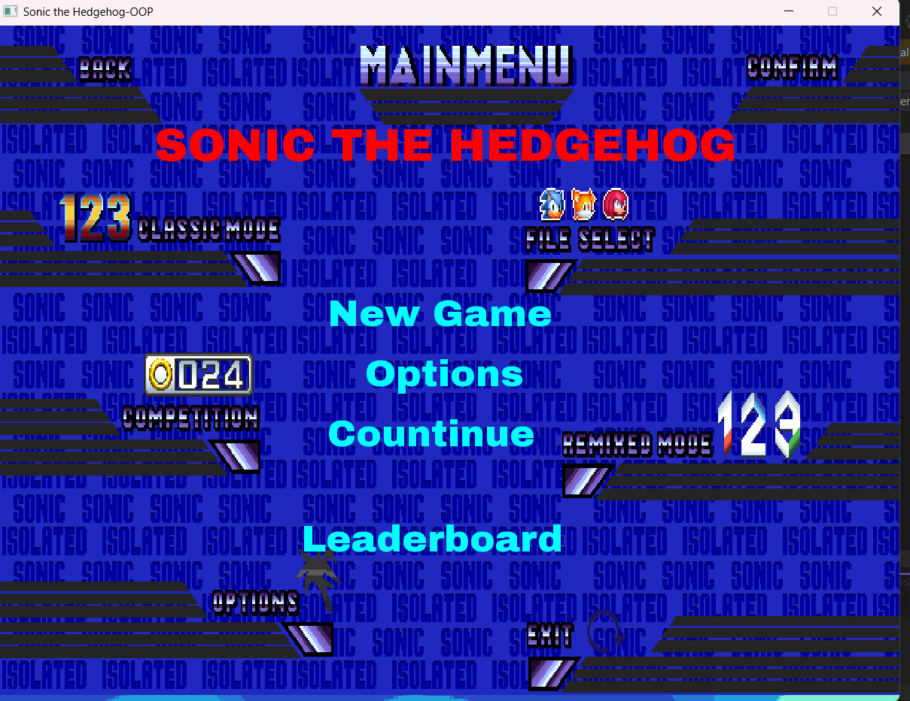
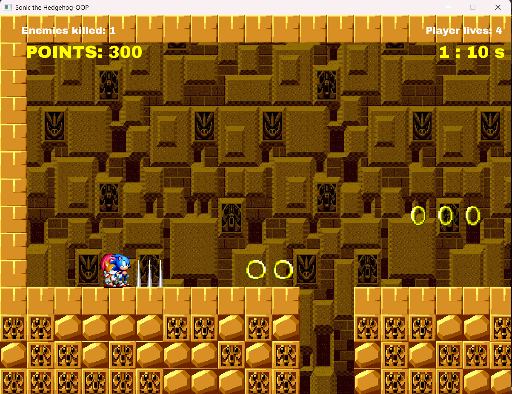
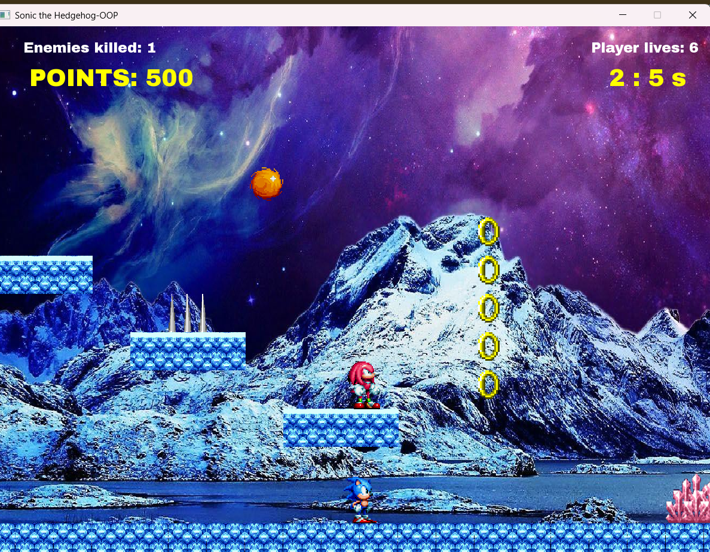
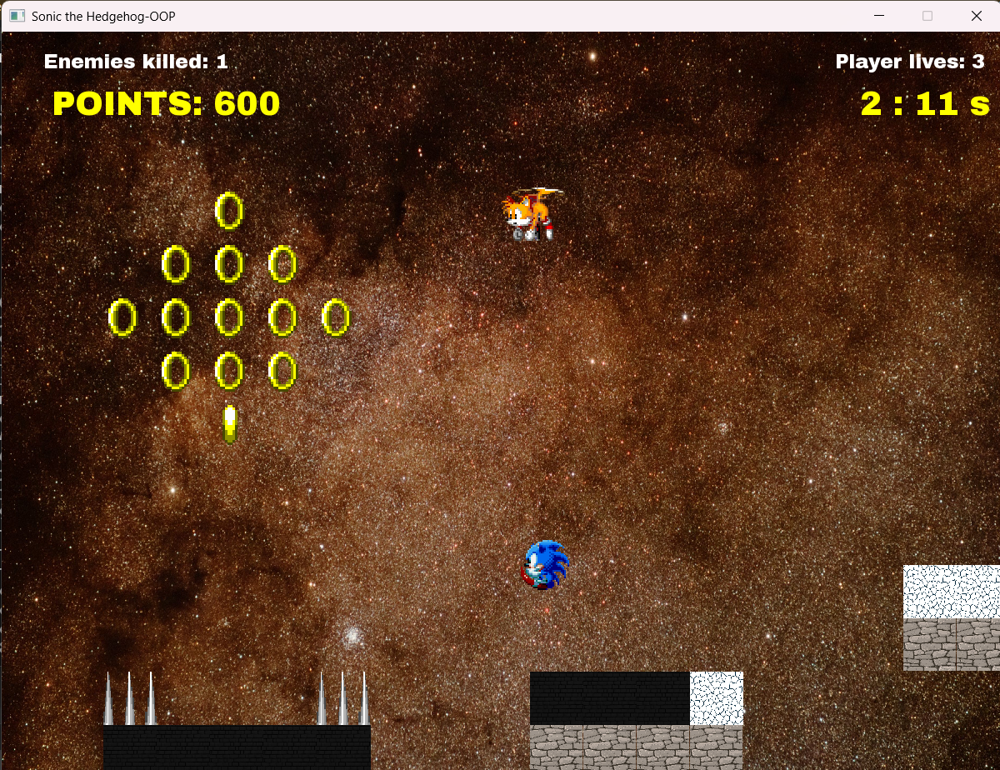
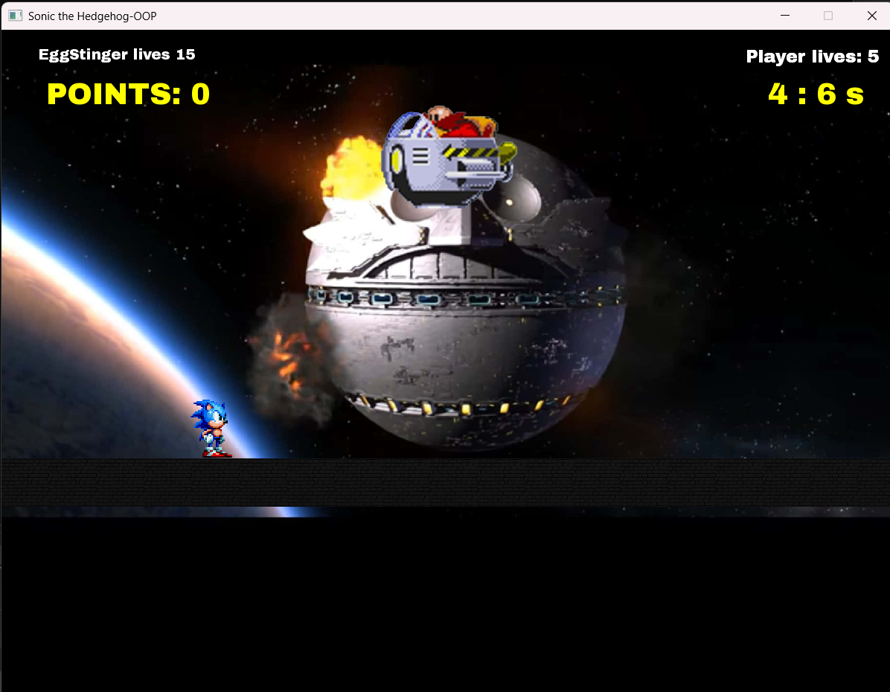
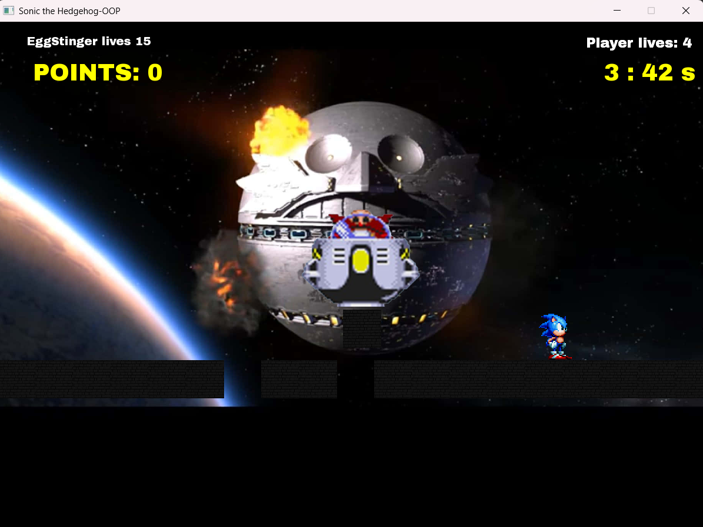
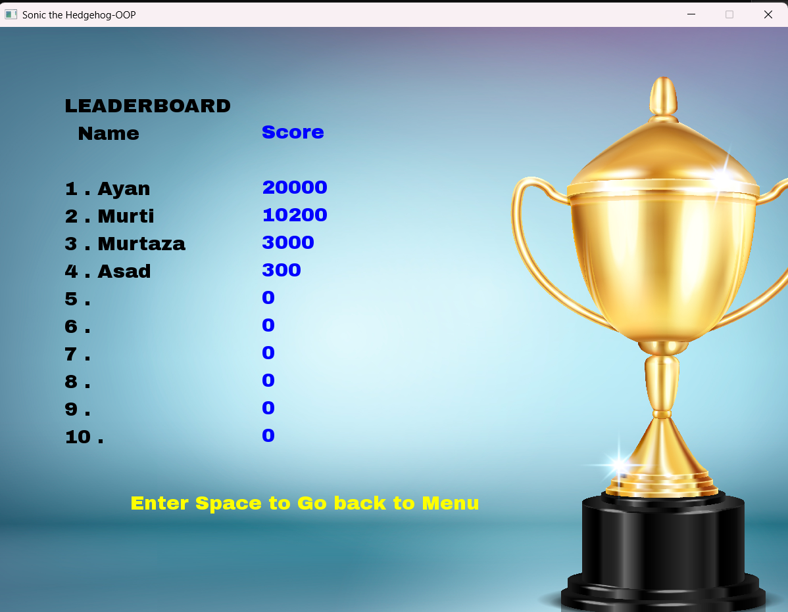

# 🎮 Sonic Universe Platformer


A feature-complete, Sonic-inspired 2D platformer game built in **C++ using SFML**, developed as a university **Object-Oriented Programming (OOP)** course project. The game includes a full menu system, three playable characters with unique abilities, five distinct enemy types, four levels, physics-based mechanics, power-ups, and a persistent leaderboard system.


## 📌 Project Overview

This game is a fully playable, multi-system platformer that goes beyond a basic student project. It combines:

- A **complete menu-driven game system** (New Game, Continue, Options, Leaderboard)
- **Three playable characters**, each with unique base abilities and power-up enhancements
- **Five enemy types** with individual movement patterns and behaviors
- **Four themed levels** with progressively complex mechanics
- **Physics-based gameplay** including gravity manipulation in Level 3
- **Save/Continue system** that persists the player's level progress
- **Top 10 leaderboard** with persistent score storage

The primary focus of this project was to apply **OOP principles** in building a scalable, modular game architecture where every system (players, enemies, levels, UI, collectibles) is independently designed and interconnected through clean class relationships.


## 📸 Screenshots


### Main Menu


### Level 1 — Normal Stage


### Level 2 — Frozen Theme


### Level 3 — Gravity / Space Theme


### Level 4 — Boss Arena


### Leaderboard Screen


### Options Menu


---

## 🧩 Features

### 🏠 Main Menu System

The game opens with a polished main menu offering four options:

| Option | Description |
|--------|-------------|
| 🆕 New Game | Start a fresh playthrough from Level 1 |
| ▶️ Continue | Resume from the last saved level |
| ⚙️ Options | Adjust sound, music theme, and volume |
| 🏆 Leaderboard | View the Top 10 highest scoring players |

### ⚙️ Options System

Players can customize their audio experience:
- Toggle **sound effects** on or off
- Select the **background music theme**
- Adjust the **master volume** level

### 💾 Save & Continue System

- The game automatically saves progress when a player exits mid-game
- On selecting **Continue**, the game resumes from the exact level the player left
- For example: exiting during Level 2 will restart from Level 2, not Level 1

### 🏆 Leaderboard System

- Tracks and displays the **Top 10 highest scores**
- Scores persist across sessions using file-based storage
- Encourages replayability and competition between players

---
## 🎮 Controls

| Key | Action |
|-----|--------|
| ← → Arrow Keys | Move left / right |
| ↑ Arrow Key | Move up |
| ↓ Arrow Key | Move down |
| `Space` | Jump |
| `Z` | Tails — Fly |
| `S` | Switch character |

---

## 👤 Characters

The player selects one of three playable characters before starting the game. Each character has a **unique base ability** and a **power-up enhancement** that is unlocked by collecting the special ability item during gameplay.

### ⚡ Sonic
- **Base Ability:** Super speed — Sonic moves faster than the other characters by default
- **Power-Up Enhancement:** Speed is further boosted for a limited duration

### 🦊 Tails
- **Base Ability:** Flight — Tails can fly, allowing access to elevated platforms and skipping certain obstacles
- **Power-Up Enhancement:** Flight duration is significantly extended after collecting the power-up

### 💪 Knuckles
- **Base Ability:** Wall breaking — Knuckles can break through certain walls and barriers
- **Power-Up Enhancement:** Gains **invisibility** for a limited time after collecting the power-up, allowing him to pass through enemies undetected

---

## 👾 Enemy System

The game features **five distinct enemy types**, each with its own movement behavior, attack pattern, and collision logic. All enemies are derived from a shared base `enemy.h` class using inheritance.

| Enemy | Type | Behavior |
|-------|------|----------|
| 🐝 Bee Bot | Flying | Airborne enemy with patrol movement patterns |
| 🦀 Crab Meat | Ground | Walks along platforms and reverses at edges |
| 🪲 Moto Bug | Ground | Fast-moving ground enemy that charges the player |
| 🐙 Egg Stinger | Ranged | Fires projectiles at the player from a fixed position |
| 🦇 Bat Brain | Flying | Swoops at the player from above with tracking movement |

Enemies cause **damage on contact** and trigger a **stun effect** on the player. Some enemies require the player to jump on them from above to defeat.

---

## 🎮 Gameplay Mechanics

| Mechanic | Description |
|----------|-------------|
| ❤️ Health System | Player has a health bar. Health can be lost from enemy contact or obstacles |
| 💎 Collectibles | Rings and items scattered across levels increase the player's score |
| ⚡ Power-Ups | Special ability items that enhance each character's unique power |
| 🩹 Health Pickups | Items placed in levels that restore the player's health |
| 💀 Spikes & Obstacles | Static hazards that deal damage and stun the player on contact |
| 🌌 Gravity Mechanics | In Level 3, gravity is reduced/altered, changing the player's movement behavior |
| 🧠 Collision Detection | Precise collision system for platforms, enemies, walls, and collectibles |
| 🏃 Physics | Smooth movement with inertia, jumping arc, and gravity simulation |

---

## 🗺️ Level Design

The game contains **four levels**, each with a distinct theme, increasing difficulty, and new mechanical elements.

### 🟩 Level 1 — Normal Stage
The introductory level. Players learn the core movement mechanics, encounter basic enemies (Moto Bug, Crab Meat), and collect rings. Platform layout is straightforward with gradual difficulty ramp.

### 🏫 Level 2 — School Theme
A more complex level with denser enemy placement, tighter platform gaps, and more obstacle variety. Bee Bot and Bat Brain enemies are introduced here, requiring vertical awareness.

### 🌌 Level 3 — Gravity Level (Space Theme)
The standout level of the game. The environment is themed around outer space, and **gravity mechanics are altered**, making the player's movement significantly lighter and floatier. Players must adapt their timing for jumps and enemy interactions. Egg Stinger enemies appear here, requiring the player to dodge projectiles.

### 👑 Level 4 — Boss Level
The final level pits the player against a **large boss enemy** with multiple attack phases. This level tests all the mechanics learned in previous levels. Defeating the boss completes the game and submits the player's score to the leaderboard.

---

## 🏗️ Project Structure

```
Sonic/
│
├── main.cpp               ← Game entry point
│
├── game.h                 ← Core game loop and engine logic
├── menu.h                 ← Main menu system (New Game, Continue, Options, Leaderboard)
├── level.h                ← Level loading, rendering, and progression management
│
├── player.h               ← Base player class (movement, health, physics)
├── Characters.h           ← Character selection and shared character logic
├── sonic.h                ← Sonic — speed ability and power-up logic
├── tails.h                ← Tails — flight ability and power-up logic
├── knuckles.h             ← Knuckles — wall break and invisibility power-up logic
│
├── enemy.h                ← Base enemy class (collision, health, AI interface)
├── batBrain.h             ← Bat Brain enemy — swooping flying AI
├── beeBot.h               ← Bee Bot enemy — patrol flying AI
├── crabMeat.h             ← Crab Meat enemy — ground reversal AI
├── eggStinger.h           ← Egg Stinger enemy — projectile attack logic
├── motoBug.h              ← Moto Bug enemy — fast charge AI
│
├── collectables.h         ← Rings and health pickup logic
├── obstacles.h            ← Spikes and environmental hazards
├── animations.h           ← Sprite animation state machine
│
└── Data/                  ← Game assets (textures, sounds, save files)
    ├── textures/
    ├── sounds/
```

---

## 🧠 OOP Design Patterns

This project applies core **Object-Oriented Programming principles** throughout its architecture:

### Encapsulation
Each game system is self-contained within its own class. The player's health, the enemy's movement state, and the level's tile data are all managed internally and exposed only through controlled interfaces. This keeps each class independent and reduces coupling.

### Inheritance
A clear hierarchy is used for both characters and enemies:

```
Player (base)
 ├── Sonic
 ├── Tails
 └── Knuckles

Enemy (base)
 ├── BatBrain
 ├── BeeBot
 ├── CrabMeat
 ├── EggStinger
 └── MotoBug
```

Shared behavior (movement, collision, health) is defined in the base class, while each subclass overrides or extends specific behavior.

### Polymorphism
The game loop interacts with all enemies through a pointer to the base `Enemy` class. Each enemy type provides its own implementation of movement, AI behavior, and attack — without the game loop needing to know which specific type it is handling. The same applies to characters.

### Abstraction
Complex subsystems (animation states, collision resolution, level loading) are abstracted behind clean class interfaces. The game loop calls `player.update()`, `enemy.update()`, and `level.render()` without caring about the internal details.

### Modular Architecture
Each header file is a standalone module. Adding a new enemy type, character, or level requires creating a new class and plugging it in — existing code does not need to be modified. This follows the **Open/Closed Principle**.

---

## 🚀 How to Run

### Prerequisites
- **SFML 2.5** or later installed
- A C++ compiler supporting **C++17** (Visual Studio, MinGW, or Clang)
- IDE: Visual Studio, Code::Blocks, or CLion (recommended)

### Steps

**1. Clone the repository**
```bash
git clone https://github.com/yourusername/sonic-universe-platformer.git
cd sonic-universe-platformer
```

**2. Link SFML**

In your IDE project settings, link the following SFML libraries:
```
sfml-graphics
sfml-window
sfml-system
sfml-audio
```

**3. Build the project**

Compile `main.cpp` with all header files in scope.

**4. Run the executable**

Ensure the `Data/` folder is in the same directory as the compiled executable (it contains textures and sound files required at runtime).

---

## 🔮 Future Improvements

- **Online Leaderboard** — Replace file-based score storage with a cloud/server-based system
- **Smarter Enemy AI** — Add pathfinding (A* algorithm) for more dynamic enemy behavior
- **Additional Characters** — Amy Rose, Shadow, or Silver with new ability sets
- **More Levels** — Underwater level, lava/fire level, or a bonus stage
- **Cutscenes & Story** — Add intro and between-level story sequences
- **Controller Support** — Gamepad input for a more authentic console experience
- **Animated Boss Phases** — Multi-phase boss with changing attack patterns per health threshold
- **UI/UX Polish** — Animated menus, transition effects, and HUD improvements
- **Cloud Save System** — Cross-device progress persistence

---

## 🧠 Conclusion

This project was a significant learning experience that bridged the gap between theoretical OOP knowledge and practical game development. Building a complete game system — with multiple characters, enemy types, levels, a menu, save system, and leaderboard — required careful architectural thinking and consistent application of OOP principles throughout.

The most challenging and rewarding parts were:

- Designing the **inheritance hierarchy** for both characters and enemies so that shared behavior was defined once and specialized behavior was cleanly overridden
- Implementing **gravity mechanics** in Level 3 that altered the physics system without breaking other levels
- Building the **save/continue system** to correctly persist and restore game state
- Balancing gameplay across levels to create a progressively challenging experience

Overall, this project solidified my understanding of how OOP design translates into real-world software architecture — not just in games, but in any system where multiple components need to interact in a clean, scalable, and maintainable way.

---

## 📜 License

This project is licensed under the **MIT License** — see the [LICENSE](LICENSE) file for details.

---

## 🙌 Acknowledgements

- Inspired by the classic **Sonic the Hedgehog** franchise by SEGA
- Built using **SFML** — Simple and Fast Multimedia Library
- Developed as part of the **Object-Oriented Programming** coursework

---

> *"Good software is built on good structure. Good games are built on great ideas. This project was the intersection of both."*
